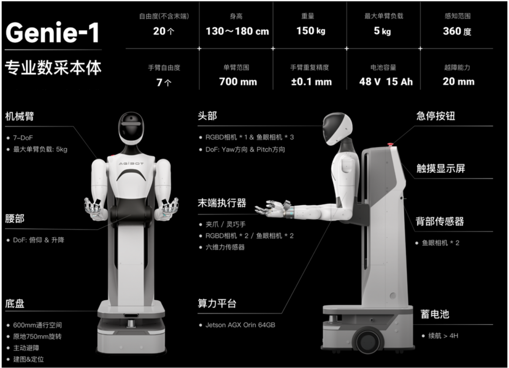

# AgiBot-World-Beta 数据集

## 1.1 数据集概览

AgiBot World 是一个全栈式、开源的具身智能生态系统。基于他们开发的硬件平台 AgiBot G1，构建了 AgiBot World——一个由 100 多台同质机器人采集的开源机器人操作数据集，为涵盖各种现实场景的高难度任务提供了高质量的数据。



Beta版本包含 1,001,552 条轨迹，总时长 2976.4 小时，覆盖 217 个具体任务、87 种技能和 106 个场景。不仅限于实验室中的基础桌面任务（如抓取与放置）；而是聚焦于包含双臂操作、灵巧手和协作任务的真实场景。

数据大小约 **41.64** TB

## 1.2 数据集结构

数据集大致分为四个部分，它是按照 **数据类型（Modalities）** 来分层，而不是按时间步（Episodes）来给每个任务分。

```text
data
├── task_info
│   ├── task_327.json
│   ├── task_352.json
│   └── ...
├── observations
│   ├── 327 # 表示任务 ID
│   │   ├── 648642 # 表示回合 ID
│   │   │   ├── depth # 包含深度信息的文件夹，以 PNG 格式保存
│   │   │   ├── videos # 包含所有摄像头视角视频的文件夹
│   │   ├── 648649
│   │   │   └── ...
│   │   └── ...
│   ├── 352
│   │   ├── 648544
│   │   │   ├── depth
│   │   │   ├── videos
│   │   ├── 648564
│   │   │   └── ...
│   └── ...
├── parameters
│   ├── 327
│   │   ├── 648642
│   │   │   ├── camera
│   │   ├── 648649
│   │   │   └── camera
│   │   └── ...
│   └── 352
│       ├── 648544
│       │   ├── camera # 包含所有摄像头的内参和外参参数
│       └── 648564
│       │    └── camera
|       └── ...
├── proprio_stats
│   ├── 327[task_id]
│   │   ├── 648642[episode_id]
│   │   │   ├── proprio_stats.h5 # 包含机器人所有本体感受信息的文件
│   │   ├── 648649
│   │   │   └── proprio_stats.h5
│   │   └── ...
│   ├── 352[task_id]
│   │   ├── 648544[episode_id]
│   │   │   ├── proprio_stats.h5
│   │   └── 648564
│   │    └── proprio_stats.h5
│   └── ...
```

| 文件夹名称        | 核心作用       | 包含的具体内容                                                                                 |
| ----------------- | -------------- | ---------------------------------------------------------------------------------------------- |
| **observations**  | 原始观测       | 主要是图像数据源，包括不同视角的图像生成的图片或视频，有RGB和深度两种                          |
| **parameters**    | 环境与相机内参 | 存储相机内参（**Intrinsic**）和外参（**Extrinsic**）。                                         |
| **proprio_stats** | 本体状态统计   | 记录机器人的本体感知（**Proprioception**），例如关节角的角度、速度、力矩及其他统计行为的位姿。 |
| **task_info**     | 任务元信息     | 存储语义文本                                                                                   |

### 1.2.1 task_info

每个json文件存储了当前任务的描述信息，包括任务名称、初始关于场景的文本描述、任务对应的动作信息（action config）、和 epsodies_id

```JSON
[
    {
        "episode_id": 648649,
        "label_info": {
            "action_config": [
                {
                    "start_frame": 8,
                    "end_frame": 218,
                    "action_text": "Retrieve cucumber from the shelf.",
                    "skill": "Pick"
                },
                {
                    "start_frame": 218,
                    "end_frame": 436,
                    "action_text": "Place the held cucumber into the plastic bag in the shopping cart.",
                    "skill": "Place"
                },
                {
                    "start_frame": 436,
                    "end_frame": 654,
                    "action_text": "Retrieve tomato from the shelf.",
                    "skill": "Pick"
                },
                {
                    ...
                }
            ]
        },
        "task_name": "Pickup items in the supermarket",
        "init_scene_text": "The robot is positioned in front of the fruit stand in the supermarket environment."
    },
```

## 1.2.2 observations

**RGB图像数据**：整个机器人共有8个相机，头部中间的相机、头部中间的鱼眼相机、头部左侧的鱼眼相机、头部右侧的鱼眼相机、后脑勺左侧鱼眼相机、后脑勺右侧鱼眼相机、左手相机、右手相机（共包括3个普通相机，5个鱼眼相机）。其中，fisheye相机分辨率都为960 × 768，普通相机分辨率为640 × 480。

视频文件目录结构如下：

```JSON
observations/
└── 327/
    ├── 648642/
    │   └── videos/
    │       ├── back_left_fisheye_color.mp4
    │       ├── back_right_fisheye_color.mp4
    │       ├── hand_left_color.mp4
    │       ├── hand_right_color.mp4
    │       ├── head_center_fisheye_color.mp4
    │       ├── head_color.mp4
    │       ├── head_left_fisheye_color.mp4
    │       └── head_right_fisheye_color.mp4
    └── 648649/                  # 回合 ID（示例2）
        └── videos/
             ...
```

## 1.2.3 parameters

这个主要是记录各个相机的内外参数的，这里暂时不需要。

## 1.2.4 proprio_stats

这是要重点关注的文件，这里主要分为 action和 observation.state 两个部分，记录了机器人本体的状态，以及动作状态，可以直接转为lerobot的，也可以获取到各个关节的eef等。parse如下：

```text
action/
  effector/
    force       [shape=(0,), dtype=float32]
    index       [shape=(2418,), dtype=int64]
    position    [shape=(2418, 2), dtype=float64]
  end/
    index       [shape=(2300,), dtype=int64]
    orientation [shape=(2418, 2, 4), dtype=float64]
    position    [shape=(2418, 2, 3), dtype=float64]
  head/
    index       [shape=(2418,), dtype=int64]
    position    [shape=(2418, 2), dtype=float64]
  joint/
    effort      [shape=(0,), dtype=float32]
    index       [shape=(2300,), dtype=int64]
    position    [shape=(2418, 14), dtype=float64]
    velocity    [shape=(0,), dtype=float32]
  robot/
    angular     [shape=(0,), dtype=float32]
    index       [shape=(2418,), dtype=int64]
    orientation [shape=(0,), dtype=float32]
    position    [shape=(0,), dtype=float32]
    velocity    [shape=(2418, 2), dtype=float64]
  waist/
    index       [shape=(2418,), dtype=int64]
    position    [shape=(2418, 2), dtype=float64]
state/
  effector/
    force            [shape=(0,), dtype=float32]
    position         [shape=(2418, 2), dtype=float64]
  end/
    angular          [shape=(0,), dtype=float32]
    orientation      [shape=(2418, 2, 4), dtype=float64]
    position         [shape=(2418, 2, 3), dtype=float64]
    velocity         [shape=(0,), dtype=float32]
    wrench           [shape=(0,), dtype=float32]
  head/
    effort           [shape=(0,), dtype=float32]
    position         [shape=(2418, 2), dtype=float64]
    velocity         [shape=(0,), dtype=float32]
  joint/
    current_value    [shape=(2418, 14), dtype=float64]
    effort           [shape=(0,), dtype=float32]
    position         [shape=(2418, 14), dtype=float64]
    velocity         [shape=(0,), dtype=float32]
  robot/
    orientation      [shape=(0,), dtype=float32]
    orientation_drift[shape=(0,), dtype=float32]
    position         [shape=(0,), dtype=float32]
    position_drift   [shape=(0,), dtype=float32]
  waist/
    effort           [shape=(0,), dtype=float32]
    position         [shape=(2418, 2), dtype=float64]
    velocity         [shape=(0,), dtype=float32]
timestamp  [shape=(2418,), dtype=int64]

```

二级字段含义描述如下：

- **效应器（effector）**：指末端效应器，例如灵巧手或抓手。
- **末端（end）**：机器人手指上的 6 自由度（6DoF）末端位姿。
- **头部（head）**：为机器人的头部视角，有两个自由度（俯仰 pitch 和偏航 yaw，对应上下角度和左右角度）。
- **关节（joint）**：指机器人双臂的关节，共有 14 个自由度，每只手臂有 7 个自由度。
- **机器人（robot）**：指机器人在其周围环境中的姿态，方向和位置是指机器人在测程坐标系（odometry coordinate）中的相对姿态，其中原点是在机器人通电之后设定的。
- **腰部（waist）**：指机器人腰部关节，有两个自由度（俯仰 pitch 和升降 lift）。

<table border="1" cellpadding="8" cellspacing="0" style="border-collapse: collapse; width: 100%;">
  <thead>
    <tr>
      <th style="border: 1px solid #ccc; text-align: left; font-weight: bold;">Group</th>
      <th style="border: 1px solid #ccc; text-align: left; font-weight: bold;">Shape</th>
      <th style="border: 1px solid #ccc; text-align: left; font-weight: bold;">含义</th>
    </tr>
  </thead>
  <tbody>
    <tr>
      <td style="border: 1px solid #ccc;">/timestamp</td>
      <td style="border: 1px solid #ccc;">[N]</td>
      <td style="border: 1px solid #ccc;">时间戳（纳秒）</td>
    </tr>
    <tr>
      <td style="border: 1px solid #ccc;">/state/effector/position (gripper)</td>
      <td style="border: 1px solid #ccc;">[N, 2]</td>
      <td style="border: 1px solid #ccc;">左 <code>[:, 0]</code>，右 <code>[:, 1]</code>，夹爪张开范围（毫米）</td>
    </tr>
    <tr>
      <td style="border: 1px solid #ccc;">/state/effector/position (dexhand)</td>
      <td style="border: 1px solid #ccc;">[N, 12]</td>
      <td style="border: 1px solid #ccc;">左 <code>[:, :6]</code>，右 <code>[:, 6:]</code>，手指关节角（弧度）</td>
    </tr>
    <tr>
      <td style="border: 1px solid #ccc;">/state/end/orientation</td>
      <td style="border: 1px solid #ccc;">[N, 2, 4]</td>
      <td style="border: 1px solid #ccc;">左 <code>[:, 0, :]</code>，右 <code>[:, 1, :]</code>，法兰四元数（xyzw）</td>
    </tr>
    <tr>
      <td style="border: 1px solid #ccc;">/state/end/position</td>
      <td style="border: 1px solid #ccc;">[N, 2, 3]</td>
      <td style="border: 1px solid #ccc;">左 <code>[:, 0, :]</code>，右 <code>[:, 1, :]</code>，法兰 xyz（米）</td>
    </tr>
    <tr>
      <td style="border: 1px solid #ccc;">/state/head/position</td>
      <td style="border: 1px solid #ccc;">[N, 2]</td>
      <td style="border: 1px solid #ccc;">yaw <code>[:, 0]</code>，pitch <code>[:, 1]</code>（弧度）</td>
    </tr>
    <tr>
      <td style="border: 1px solid #ccc;">/state/joint/current_value</td>
      <td style="border: 1px solid #ccc;">[N, 14]</td>
      <td style="border: 1px solid #ccc;">左臂 <code>[:, :7]</code>，右臂 <code>[:, 7:]</code></td>
    </tr>
    <tr>
      <td style="border: 1px solid #ccc;">/state/joint/position</td>
      <td style="border: 1px solid #ccc;">[N, 14]</td>
      <td style="border: 1px solid #ccc;">左臂 <code>[:, :7]</code>，右臂 <code>[:, 7:]</code>（弧度）</td>
    </tr>
    <tr>
      <td style="border: 1px solid #ccc;">/state/robot/orientation</td>
      <td style="border: 1px solid #ccc;">[N, 4]</td>
      <td style="border: 1px solid #ccc;">四元数（xyzw），仅 yaw 变化</td>
    </tr>
    <tr>
      <td style="border: 1px solid #ccc;">/state/robot/position</td>
      <td style="border: 1px solid #ccc;">[N, 3]</td>
      <td style="border: 1px solid #ccc;">xyz 位置，z 恒为 0（米）</td>
    </tr>
    <tr>
      <td style="border: 1px solid #ccc;">/state/waist/position</td>
      <td style="border: 1px solid #ccc;">[N, 2]</td>
      <td style="border: 1px solid #ccc;">pitch <code>[:, 0]</code>（弧度），lift <code>[:, 1]</code>（米）</td>
    </tr>
    <tr>
      <td style="border: 1px solid #ccc;">/action/*/index</td>
      <td style="border: 1px solid #ccc;">[M]</td>
      <td style="border: 1px solid #ccc;">action 索引，表示控制源正在发送信号的时刻</td>
    </tr>
    <tr>
      <td style="border: 1px solid #ccc;">/action/effector/position (gripper)</td>
      <td style="border: 1px solid #ccc;">[N, 2]</td>
      <td style="border: 1px solid #ccc;">左 <code>[:, 0]</code>，右 <code>[:, 1]</code>，0=完全张开，1=完全闭合</td>
    </tr>
    <tr>
      <td style="border: 1px solid #ccc;">/action/effector/position (dexhand)</td>
      <td style="border: 1px solid #ccc;">[N, 12]</td>
      <td style="border: 1px solid #ccc;">同 /state/effector/position</td>
    </tr>
    <tr>
      <td style="border: 1px solid #ccc;">/action/effector/index</td>
      <td style="border: 1px solid #ccc;">[M_1]</td>
      <td style="border: 1px solid #ccc;">末端效应器控制源发送信号时的索引</td>
    </tr>
    <tr>
      <td style="border: 1px solid #ccc;">/action/end/orientation</td>
      <td style="border: 1px solid #ccc;">[N, 2, 4]</td>
      <td style="border: 1px solid #ccc;">同 /state/end/orientation</td>
    </tr>
    <tr>
      <td style="border: 1px solid #ccc;">/action/end/position</td>
      <td style="border: 1px solid #ccc;">[N, 2, 3]</td>
      <td style="border: 1px solid #ccc;">同 /state/end/position</td>
    </tr>
    <tr>
      <td style="border: 1px solid #ccc;">/action/end/index</td>
      <td style="border: 1px solid #ccc;">[M_2]</td>
      <td style="border: 1px solid #ccc;">同其他 index</td>
    </tr>
    <tr>
      <td style="border: 1px solid #ccc;">/action/head/position</td>
      <td style="border: 1px solid #ccc;">[N, 2]</td>
      <td style="border: 1px solid #ccc;">同 /state/head/position</td>
    </tr>
    <tr>
      <td style="border: 1px solid #ccc;">/action/head/index</td>
      <td style="border: 1px solid #ccc;">[M_3]</td>
      <td style="border: 1px solid #ccc;">同其他 index</td>
    </tr>
    <tr>
      <td style="border: 1px solid #ccc;">/action/joint/position</td>
      <td style="border: 1px solid #ccc;">[N, 14]</td>
      <td style="border: 1px solid #ccc;">同 /state/joint/position</td>
    </tr>
    <tr>
      <td style="border: 1px solid #ccc;">/action/joint/index</td>
      <td style="border: 1px solid #ccc;">[M_4]</td>
      <td style="border: 1px solid #ccc;">同其他 index</td>
    </tr>
    <tr>
      <td style="border: 1px solid #ccc;">/action/robot/velocity</td>
      <td style="border: 1px solid #ccc;">[N, 2]</td>
      <td style="border: 1px solid #ccc;">x 轴速度 <code>[:, 0]</code>，yaw 角速度 <code>[:, 1]</code></td>
    </tr>
    <tr>
      <td style="border: 1px solid #ccc;">/action/robot/index</td>
      <td style="border: 1px solid #ccc;">[M_5]</td>
      <td style="border: 1px solid #ccc;">同其他 index</td>
    </tr>
    <tr>
      <td style="border: 1px solid #ccc;">/action/waist/position</td>
      <td style="border: 1px solid #ccc;">[N, 2]</td>
      <td style="border: 1px solid #ccc;">同 /state/waist/position</td>
    </tr>
    <tr>
      <td style="border: 1px solid #ccc;">/action/waist/index</td>
      <td style="border: 1px solid #ccc;">[M_6]</td>
      <td style="border: 1px solid #ccc;">同其他 index</td>
    </tr>
  </tbody>
</table>
